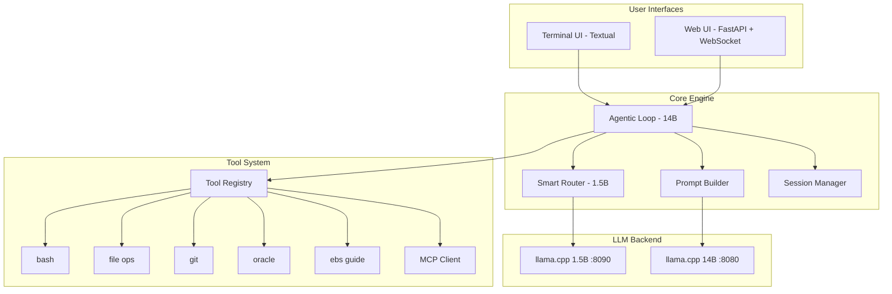

# Custom LLM Agent Platform - "CodeAgent"

## Why This Beats OpenCode

OpenCode wastes ~14,000 tokens on system prompt before you even type a word. Our agent will use ~2,000 tokens max by:
- Only injecting tools relevant to the current request (not all 9+ tools every time)
- Using a smart router (1.5B model) to classify requests first
- Compact tool definitions (OpenCode uses verbose JSON Schema format)
- No bloated framework overhead

## Architecture



## Tech Stack

- **Language**: Python 3.10+ (already on server)
- **TUI**: `textual` library (modern terminal UI, async, rich rendering)
- **Web**: `fastapi` + `uvicorn` + WebSocket for streaming
- **LLM Client**: `httpx` (async HTTP to llama.cpp)
- **Oracle**: `oracledb` (already installed)
- **MCP**: Custom MCP client (JSON-RPC over stdio/SSE)
- **Config**: YAML-based config

## Directory Structure on Server

```
/opt/codeagent/
├── core/
│   ├── agent.py          # Main agentic loop (tool call -> execute -> re-prompt)
│   ├── router.py         # 1.5B classifier: coding|ebs|simple|system
│   ├── llm.py            # Async LLM client (streaming + non-streaming)
│   ├── prompt.py         # Smart prompt builder (<2000 token system prompt)
│   ├── session.py        # Conversation history with token-aware truncation
│   └── config.py         # YAML config loader
├── tools/
│   ├── base.py           # BaseTool class + ToolRegistry
│   ├── bash.py           # Bash command execution with timeout + safety
│   ├── file_ops.py       # read, write, edit, glob, grep
│   ├── git.py            # git status, diff, commit, log
│   ├── oracle.py         # oracle_query, oracle_schema, sql_validate, explain
│   └── ebs.py            # ebs_module_guide with table knowledge
├── mcp/
│   ├── client.py         # MCP protocol client (stdio + SSE transport)
│   └── registry.py       # Dynamic tool registration from MCP servers
├── skills/
│   ├── loader.py         # Load .md skill files from directory
│   └── manager.py        # Activate/deactivate skills per session
├── ui/
│   ├── tui/
│   │   └── app.py        # Textual-based TUI (chat, tool output, status)
│   └── web/
│       ├── app.py        # FastAPI server with WebSocket streaming
│       └── static/
│           └── index.html # Modern web UI
├── config.yaml           # All configuration
├── main.py               # CLI entry point
└── requirements.txt      # Dependencies
```

## Key Design: Smart Prompt Builder

This is the core advantage over OpenCode. Instead of dumping ALL tool definitions into every request:

```
Request: "Hello, how are you?"
  -> Router classifies: "simple"
  -> Prompt: Just system identity (200 tokens)
  -> Uses 1.5B model (instant response)

Request: "Write a Python script to parse CSV"
  -> Router classifies: "coding"  
  -> Prompt: System + bash + file_ops tools only (800 tokens)
  -> Uses 14B model

Request: "Show me all POs from vendor ABC"
  -> Router classifies: "ebs"
  -> Prompt: System + oracle + ebs tools only (1200 tokens)
  -> Uses 14B model

Request: "git status and commit changes"
  -> Router classifies: "system"
  -> Prompt: System + bash + git tools only (600 tokens)
  -> Uses 14B model
```

## Key Design: Agentic Loop

```
User message
  -> Router classifies request type
  -> Prompt builder assembles minimal prompt + relevant tools
  -> LLM generates response (may include tool calls)
  -> If tool call detected:
       -> Execute tool safely
       -> Append tool result to conversation
       -> Re-prompt LLM with updated context
       -> Repeat (max 10 iterations)
  -> Final text response displayed to user
```

Tool calling format: We will use Qwen's native `<tool_call>` format which the model already knows, keeping token overhead minimal.

## Phase Breakdown

### Phase 1: Core Engine (Day 1-2)
- `core/llm.py` - async streaming client for llama.cpp
- `core/prompt.py` - smart prompt builder with tool injection
- `core/agent.py` - agentic loop with tool call parsing (Qwen format)
- `core/session.py` - conversation history with token-aware trimming
- `core/router.py` - 1.5B-based request classifier
- `core/config.py` - YAML config

### Phase 2: Tool System (Day 2-3)
- `tools/base.py` - BaseTool + ToolRegistry + compact definition format
- `tools/bash.py` - safe bash execution with timeout
- `tools/file_ops.py` - read, write, edit, search
- `tools/git.py` - common git operations
- `tools/oracle.py` - Oracle DB tools (query, schema, validate, explain)
- `tools/ebs.py` - EBS module guide

### Phase 3: Terminal UI (Day 3-4)
- `ui/tui/app.py` - Textual-based TUI with:
  - Chat panel with markdown rendering
  - Tool execution panel (shows what tools are running)
  - Status bar (model, tokens used, session info)
  - Command palette (slash commands: /new, /model, /skill, /mcp)
  - Streaming token display

### Phase 4: Web UI (Day 4-5)
- `ui/web/app.py` - FastAPI + WebSocket
- `ui/web/static/index.html` - Modern dark UI with:
  - Chat interface with streaming
  - Tool call visualization
  - Session management
  - EBS quick actions panel
  - SQL result table display

### Phase 5: MCP Client (Day 5-7)
- `mcp/client.py` - JSON-RPC protocol implementation
  - stdio transport (spawn MCP server as subprocess)
  - SSE transport (connect to HTTP MCP servers)
- `mcp/registry.py` - auto-discover tools from MCP servers, register into ToolRegistry

### Phase 6: Skills System (Day 7-8)
- `skills/loader.py` - parse .md skill files
- `skills/manager.py` - activate per session, inject into prompt only when relevant

### Phase 7: Systemd + Nginx (Day 8)
- Service files for TUI access and web UI
- Nginx proxy for web UI
- Auto-start on boot

## Config Example (config.yaml)

```yaml
models:
  main:
    url: http://127.0.0.1:8080/v1
    name: qwen2.5-coder-14b
    ctx_size: 16384
    max_output: 4096
  fast:
    url: http://127.0.0.1:8090/v1
    name: qwen2.5-1.5b
    ctx_size: 8192
    max_output: 512

router:
  model: fast
  categories: [simple, coding, ebs, system]

tools:
  bash:
    enabled: true
    timeout: 120
    blocked_commands: [rm -rf /, shutdown, reboot]
  file_ops:
    enabled: true
    allowed_dirs: [/opt, /home, /root, /tmp]
  oracle:
    enabled: true
    default_host: "172.30.1.x"
    default_port: "1521"

mcp_servers:
  - name: filesystem
    command: npx @modelcontextprotocol/server-filesystem /opt
  - name: github
    url: http://localhost:3100/sse

skills_dir: /opt/codeagent/skills/library/

web:
  host: 0.0.0.0
  port: 4200

permissions:
  bash: allow
  file_write: allow
  oracle_query: allow
  dangerous_commands: ask
```
